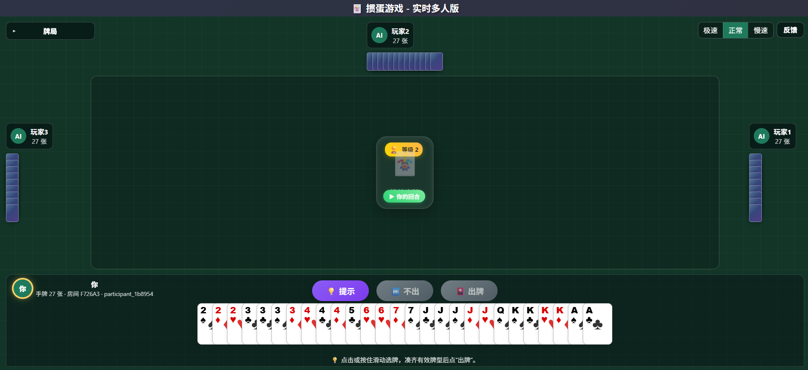

# rlcard-guandan

> 中文 | [English](#english-version)

一个面向 **掼蛋 AI 研究、算法调试和用户体验测试** 的开源项目。它提供完整的
掼蛋底层环境、公开基线智能体、命令行实验脚本，以及可以直接让用户和 AI 对打的
网页 GUI。



## 快速体验

在线体验：

- Web GUI: [https://guandan.aiwatch.icu](https://guandan.aiwatch.icu)

本地启动 GUI：

```bash
git clone https://github.com/Choysang/rlcard-guandan.git
cd rlcard-guandan

pip install -e .
pip install -r gui/backend/requirements.txt

cd gui/frontend
npm install
npm run build

cd ../..
python -m gui.backend.server
```

打开 `http://localhost:5000`。同一局域网内的手机或其他电脑可以打开服务启动时
打印的 LAN 地址。

## 这个项目有什么亮点

- **完整掼蛋环境**：支持双副牌、进贡/还贡、抗贡、接风、升级、炸弹比较等标准
  掼蛋流程。
- **开放状态与动作**：状态和动作都是可读 Python 数据，方便训练、日志、复盘和
  LLM prompt 构造。
- **网页 GUI 牌桌**：React + Flask/Socket.IO 实时牌桌，支持人类玩家和 AI 混合
  入座。
- **移动端体验**：横屏牌桌、手牌按住滑动连续选择、出牌提示、最近出牌历史。
- **调测模式**：开发人员可以创建调测房，查看其他玩家手牌、合法动作、trace 和
  耗时信息。
- **反馈与日志**：大厅和牌局内都有反馈入口，前端错误也会写入 JSONL 日志，便于
  后续迭代。
- **多种智能体**：内置随机、规则 AI、DanZero、DMC、DanZero+、PerfectDan 和
  OpenAI-compatible LLM agent。
- **可部署**：GitHub Actions 自动构建 GHCR 镜像，可用 Docker Compose 部署到
  自己的服务器。

## 掼蛋环境快速启动

安装核心环境：

```bash
pip install -e .
```

运行一局规则 AI 对战：

```python
import numpy as np
import guandan_rlcard
from guandan_rlcard.baselines import get_agent_class

env = guandan_rlcard.make({'seed': 42})

Base7 = get_agent_class('base7')
Base5 = get_agent_class('base5')

env.set_agents([
    Base7(0, np.random.RandomState(0)),  # 0/2 为一队
    Base5(1, np.random.RandomState(1)),  # 1/3 为一队
    Base7(2, np.random.RandomState(2)),
    Base5(3, np.random.RandomState(3)),
])

trajectories, payoffs = env.run()
print(payoffs)
print(env.game.gwin, env.game.winner_team)
```

命令行实验：

```bash
python examples/run_rule_match.py --team0 base7 --team1 base5 --episodes 10
python examples/run_rule_match.py --team0 danzero --team1 base7 --episodes 5
python examples/generate_dataset.py --episodes 10 --output dataset/base7.jsonl
```

LLM 对局需要先配置模型服务，见 [docs/llm_guide.md](docs/llm_guide.md)：

```bash
python examples/run_llm_match.py --opponent base5 --episodes 1
```

## GUI 功能

GUI 使用同一个 `guandan_rlcard` 底层引擎，不是另外写了一套游戏逻辑。

主要能力：

- 创建房间，配置 4 个座位是人类还是 AI。
- 可选 `random`、`base1` 到 `base8`、DanZero、DMC、DanZero+、PerfectDan、
  LLM。
- 支持一名人类和三名 AI 快速开局，也支持局域网多人加入。
- 手牌可以点击选择，也可以按住滑动连续选择多张。
- 当前可出牌时按钮亮起，支持提示和不出。
- 牌局信息折叠在角落，展开后可滚动查看本局所有出牌历史。
- 房主可控制 AI 速度：极速、正常、慢速。
- 调测房支持查看全员手牌、合法动作、trace、状态快照和耗时。
- 大厅和牌局内都有反馈入口；浏览器错误会自动上报到日志。

开发模式热更新：

```bash
# terminal 1
python -m gui.backend.server

# terminal 2
cd gui/frontend
npm run dev
```

完整 GUI 使用说明见 [docs/gui_guide.md](docs/gui_guide.md)。

## 训练好的模型怎么下载

规则 AI `random`、`base1` 到 `base8` 不需要下载权重，安装后即可使用。

DanZero 权重已经随仓库提供：

```text
guandan_rlcard/baselines/danzero/q_network.ckpt
```

PerfectDan 当前发布在 GitHub Release：

- Release: [v0.1.0](https://github.com/Choysang/rlcard-guandan/releases/tag/v0.1.0)
- Asset: `final_checkpoint.pt.perfectdan_final_checkpoint.pt.pt`

本地 GUI 推荐放置路径：

```bash
mkdir -p weights/perfectdan
curl -L \
  -o weights/perfectdan/models_v0.pt \
  https://github.com/Choysang/rlcard-guandan/releases/download/v0.1.0/final_checkpoint.pt.perfectdan_final_checkpoint.pt.pt
```

DMC 和 DanZero+ 需要你放置训练产物或后续 Release 附件，GUI 默认查找：

```text
weights/
├── dmc/model.tar
├── danzero_plus/model.tar
└── perfectdan/models_v0.pt
```

本地启动 GUI 时可以指定：

```bash
# Windows PowerShell
$env:GUANDAN_MODEL_DIR = "D:\path\to\weights"
python -m gui.backend.server

# Linux/macOS
GUANDAN_MODEL_DIR=/path/to/weights python -m gui.backend.server
```

服务器 Docker 默认挂载：

```text
/opt/guandan-gui/weights/
├── dmc/model.tar
├── danzero_plus/model.tar
└── perfectdan/models_v0.pt
```

运行中可检查权重状态：

```bash
curl http://localhost:5000/api/agents/status
```

注意：LLM agent 不下载权重。用户需要在创建房间时填写模型名、Base URL 和 API
Key；公网使用时必须走 HTTPS。

## 部署到服务器

项目已经配置 GitHub Actions，会把 GUI 后端和前端打包成 Docker 镜像并推送到
GHCR：

```text
ghcr.io/choysang/rlcard-guandan-gui:latest
ghcr.io/choysang/rlcard-guandan-gui:<branch-name>
ghcr.io/choysang/rlcard-guandan-gui:<tag>
ghcr.io/choysang/rlcard-guandan-gui:sha-<commit>
```

服务器快速启动：

```bash
mkdir -p /opt/guandan-gui
cd /opt/guandan-gui
mkdir -p weights/dmc weights/danzero_plus weights/perfectdan

# 复制 deploy/docker-compose.yml 到当前目录
GUANDAN_GUI_PUBLIC_PORT=5080 docker compose up -d
curl -fsS http://127.0.0.1:5080/healthz
```

默认只绑定 `127.0.0.1`，建议通过 Caddy/Nginx 反向代理到 HTTPS 域名。完整部署说明：
[deploy/README.md](deploy/README.md)。

## 日志与反馈

本地默认日志：

```text
logs/gui/guandan_gui.jsonl
```

Docker 内默认日志：

```text
/data/logs/gui/guandan_gui.jsonl
```

反馈事件：

```text
event_type = "feedback"
kind = "suggestion" | "bug" | "client_error"
```

建议每次迭代前先读取最近反馈：

```bash
python - <<'PY'
import json
from pathlib import Path

path = Path('logs/gui/guandan_gui.jsonl')
for line in path.read_text(encoding='utf-8').splitlines():
    event = json.loads(line)
    if event.get('event_type') == 'feedback':
        print(event['timestamp'], event.get('kind'), event.get('page'), event.get('message'))
PY
```

日志不会写入 API Key、hostToken、resumeToken 等敏感字段。

## 文档索引

- GUI 使用说明：[docs/gui_guide.md](docs/gui_guide.md)
- LLM agent 配置：[docs/llm_guide.md](docs/llm_guide.md)
- 掼蛋规则与边界情况：[docs/rules.md](docs/rules.md)
- Docker 部署：[deploy/README.md](deploy/README.md)

## 测试

```bash
pip install -e ".[dev]"
python -m pytest

cd gui/frontend
npm install
npm run test:ui
npm run build
```

## English Version

`rlcard-guandan` is an open Guandan environment for AI research, algorithm
debugging and human-facing evaluation. It provides one shared game engine,
baseline agents, command-line experiments, a browser GUI and deployment
tooling.

Live demo:

- Web GUI: [https://guandan.aiwatch.icu](https://guandan.aiwatch.icu)

### Highlights

- Full Guandan game flow: two decks, tribute, back tribute, counter tribute,
  wind-follow, level progression and bomb ordering.
- Readable Python state/action data for RL, logging, replay and LLM prompting.
- React + Flask/Socket.IO Web GUI using the same engine as the Python API.
- Human and AI seats in the same room; LAN multiplayer is supported.
- Mobile landscape table, drag-to-select hand cards, hints, pass and play
  history.
- Host-only debug rooms with hidden hands, legal actions, trace, state snapshot
  and timing data.
- Feedback and browser-error logging through append-only JSONL.
- Built-in random/rule agents plus DanZero, DMC, DanZero+, PerfectDan and an
  OpenAI-compatible LLM agent.
- GHCR Docker image and Compose deployment for servers.

### Quick GUI Start

```bash
git clone https://github.com/Choysang/rlcard-guandan.git
cd rlcard-guandan

pip install -e .
pip install -r gui/backend/requirements.txt

cd gui/frontend
npm install
npm run build

cd ../..
python -m gui.backend.server
```

Open `http://localhost:5000`.

### Quick Environment Start

```python
import numpy as np
import guandan_rlcard
from guandan_rlcard.baselines import get_agent_class

env = guandan_rlcard.make({'seed': 42})
Base7 = get_agent_class('base7')
Base5 = get_agent_class('base5')

env.set_agents([
    Base7(0, np.random.RandomState(0)),
    Base5(1, np.random.RandomState(1)),
    Base7(2, np.random.RandomState(2)),
    Base5(3, np.random.RandomState(3)),
])

trajectories, payoffs = env.run()
print(payoffs)
```

Command-line experiments:

```bash
python examples/run_rule_match.py --team0 base7 --team1 base5 --episodes 10
python examples/run_rule_match.py --team0 danzero --team1 base7 --episodes 5
python examples/generate_dataset.py --episodes 10 --output dataset/base7.jsonl
```

### Pretrained Models

No extra weights are needed for `random` and `base1`..`base8`.

DanZero ships with:

```text
guandan_rlcard/baselines/danzero/q_network.ckpt
```

PerfectDan is available from the current GitHub Release:

```bash
mkdir -p weights/perfectdan
curl -L \
  -o weights/perfectdan/models_v0.pt \
  https://github.com/Choysang/rlcard-guandan/releases/download/v0.1.0/final_checkpoint.pt.perfectdan_final_checkpoint.pt.pt
```

DMC and DanZero+ need trained artifacts at:

```text
weights/dmc/model.tar
weights/danzero_plus/model.tar
```

For local GUI runs, set `GUANDAN_MODEL_DIR=/path/to/weights`. In Docker, mount
weights under `/opt/guandan-gui/weights`.

LLM agents do not use local weights. Users enter model name, Base URL and API
Key when creating a room. Use HTTPS before entering keys on a public site.

### More Docs

- GUI guide: [docs/gui_guide.md](docs/gui_guide.md)
- LLM guide: [docs/llm_guide.md](docs/llm_guide.md)
- Rule details: [docs/rules.md](docs/rules.md)
- Deployment guide: [deploy/README.md](deploy/README.md)

## License

MIT. See [LICENSE](LICENSE).
